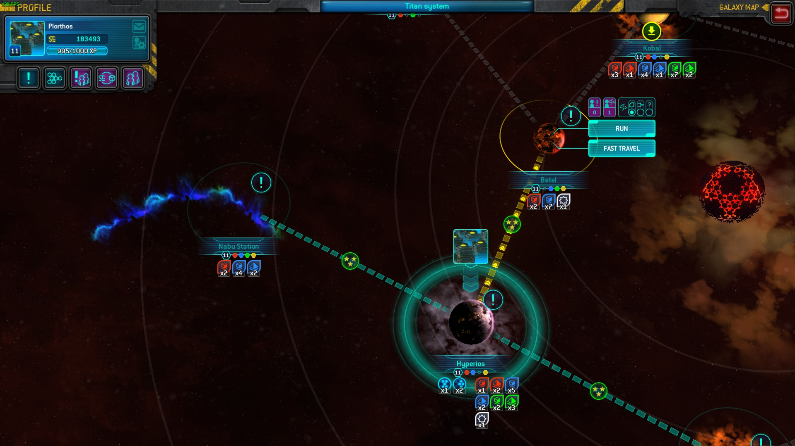
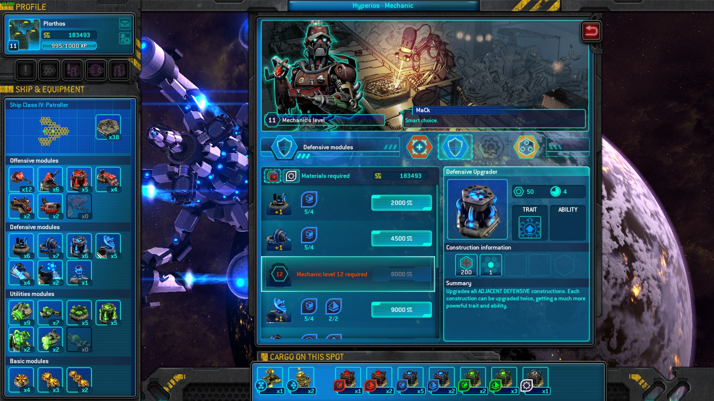
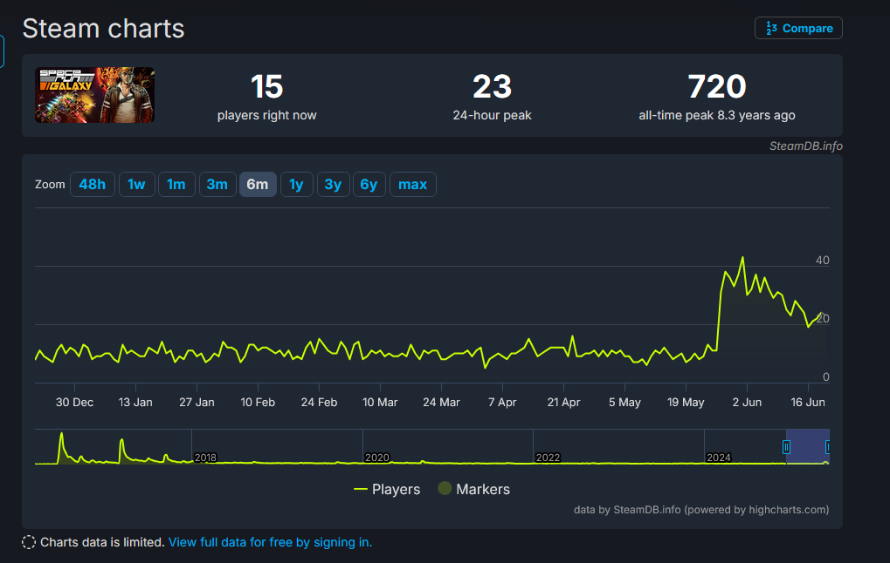
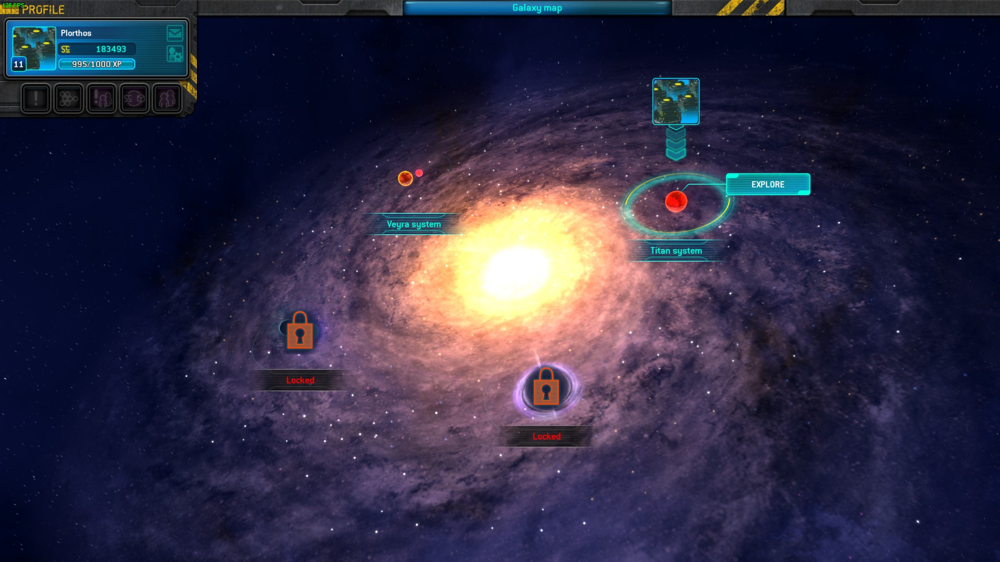

After playing through [Fieldrunners 2](/blog2/public/posts/fieldrunners2/) I was in the mood for a TD game that was more explicitly innovative. I guess my brain doesn't appreciate the monotony of slowly building out vast mazes of very loud machineguns over and over. My mind jumped to Anomaly Defenders and Space Run Galaxy, both are fairly innovative yet I never gave them too much of a chance the first time around. After spending tens of hours in both, I have some thoughts on them that other people may or may not have had before. And you are going to be reading them because you clicked on this post and are therefore contractually obligated to listen to my ramblings.

# Space Run Galaxy
I am a huge fan of the original Space Run. The design was just so interesting yet so simple. You get a hex grid ship, you have to plop down some cargo and then defend the cargo with towers. Along the way, you also have to juggle between investing in defenses or improving your speed to get a better rating. From these basic set of systems, the game builds into a beautiful entangled web of mechanics that invites highly strategic gameplay. 

For instance, each thruster you make increases your constant speed so therefore building thrusters at the start of the game is better than at the end (because you don't have to make up as much distance). However, pirates and asteroids will threaten your cargo so you also have to allocate your budget for defenses. Killing stuff is your main source of income so you have to choose between reinvesting in defenses or build more thrusters to start catching up to the time goal. To throw a wrench into things, thrusters have an active ability to pause their thrust for 30s and generate a passive income during that time which might make them a better choice.

These competiting priorities make each level feel fresh and dynamic, especially when combined with other features like having a different ship layout for each mission. My only complaints with the game is that it was too short and there was so much more to explore in a sequel. So when Space Run Galaxy was announced and released, I was ecstatic. And then I played it, and uninstalled the game after an hour.

But that was 5-8 years ago and I was a kid. Or was it? As I wrote that sentence I began doubting my memory, so I opened up Steam to check the achievement dates and... well, it was only 3 years ago. Huh. I guess Covid Time works in mysterious ways, normally it makes it seem like 2019 was just 3 years ago. Now that I think about it, I was under a lot of pressure in 2022 due to certain life events so my patience was a lot thinner for BS in games. Even in my short time playing, SRG stank of BS - coming from someone with a terrible sense of smell (not due to covid before you ask, I've had it since a kid).

The first thing that ticked me off was that the game was designed to be played while connected to the server. Technically there is an offline mode but it has a separate save data and many intended features are missing like player market and player contracts. They don't sound that significant, but more on that later. I got into a level and it seemed like the moment to moment gameplay was similar to the good old SR formula at least. You still had your hex grid and competiting priorities, and there's a shiny new mana system that makes thrusters even more useful for generating mana for active abilities. Also, there is now a proper world with a world map you can fly cargo around in - giving it depth beyond the "pick a level from 1-10" and one of the things on my wishlists for a SR sequel. The game then introduced the reason I eventually quit the game in 2022 - upgrade materials.

You see, in the original SR you could build as many towers as you wanted as long as you had the cash and space for it. In SRG, you have a limited number of towers for each tower (laser, shield, thrusters, etc) that resets every level. To increase this maximum, you had to gather the materials and craft them into the tower you desire. Each category of tower (red, green, blue) has a corresponding material (red, green, blue) and within each material category you have different levels. Think of them like Lego pieces of different color and also shape. That isn't too bad if not for the fact that these materials are also cargo. They have to be present on the same world for that world's mechanic to Lego master builder them together (provided they are a high enough level Lego master builder and they know how to build that category of tower). This means that you are going to have to repeatedly fly back and forth doing the same level over and over just to move all the Lego pieces you own into one place. You can fast travel, but materials and cargo won't travel with you. 

This was were the aformentioned multiplayer features can come in handy and really save you time. With the player market, on each world you can put your spare Lego pieces on sale on the local Craigslist. Other people can buy them and you can use the cash to buy the materials you need. You can also comission other players for a low price to deliver your cargo from A to B so you don't have to go through the grind yourself.Without those multiplayer features you could easily quadruple your playtime hunting down materials. Unfortunately for me, the first time I played the game in 2022 it had been years since the game was released and the servers were kind of dead. So I gave up and moved on to another game.

But if I knew that was the issue why did I come back? Well you see, I was lucky that not too long ago the game servers got hacked. The hackers allegedly deleted the server and its backups. The developers - Passtech Games - announced that they would refresh the servers and help people with custom saves so they don't have to start from scratch. This announcement brought back interest into the game and suddenly people were playing the game again. You can even see it in the steamdb charts!

I was in the mood for these kind of games, and this was the perfect opportunity to revisit the game. Perhaps the grind was really not that bad, and now that I am no longer a student I can afford to waste a little bit of time to investigate. I emailed Passtech, got a the lowest level custom save, and jumped back in.

I could have started from a completely fresh save but it's kind of painful to play through the early game since you are always starving for the most basic towers. With the custom save, I was having a lot of fun right from the get go. The game does a lot of things right that you can appreciate when you don't have to worry as much about towers.

In the first game, you can power up towers by placing a power generator next to it. In SRG, the generator was replaced with 3 different upgrade towers - one for each category. A red upgrade tower will only power up offensive red towers like the laser and missile, and a blue one for shields and antimissile. This system encourages forward planning since you want to build clusters of the same tower category to maximize the effect of the upgrades. Additionally, SRG introduces connector towers that will transmit the effects of towers like the shield and upgrade towers to every other tower - making it extremely satisfying to plan out a layout for a ship where the whole ship is connected. However, the forward planning potential introduced by these changes is also limited by a number of issues. 

Having more time with the flaw also exposes a number of flaws I hadn't seen originally. First, you can't pause the game to give commands, which isn't a huge issue since you can still pause with ESC but it's annoying and you can't give orders. Second, you can't see what enemies will come from which direction far in advance so it's somewhat of a gamble that the towers you place will get enemies that it counters in 3 minutes time. This is also an issue in SR, but at least in that one the waves are consistent so you can replay and plan ahead. In SRG, each time you play the same level it randomizes where enemies will come from so the most optimal strategy is to restart the level over and over until you get a wave where the enemies come from roughly the same direction, instead of ones where they come from opposite directions and now you need twice the number of towers. Third, annoying cargo has always been a staple of the series but SRG just takes it too far. There are now cargo that will annihilate your towers every minute or so and it's completely random which tower will be targetted so you can't easily play around it. 

Despite all of these issues, I still had fun with the game. Replaying levels to transport cargo and materials wasn't as painful as I thought it would be and the randomized enemy waves keep it from being completely stale (at least on the easier levels where restarting the level isn't mandatory). Having the player market also really helps out with progress and the contracts were also fun, with me trying to cram on other players' materials on to my ship in addition to regular cargo. And there's also the ability to do multiple quests at once with the open world map, trying to push my own abilities.

I haven't touched the game in a few days and I don't think I will again soon. Remember the issue with upgrade materials? Turns out it's worse than I described because the material, cash and mechanic level requirement for each tower rises the more of them you already own. Therefore you can't afford to build a stockpile of spare towers simply replaying an older easier level. This is because the game universe takes place in a galaxy that is divided into multiple systems. Only materials up to a certain level are obtainable in a system. For example, the first system only drops level 1 Lego shapes, the second system drops level 1 and 2, and so on. And in many cases, you will also be capped by your system's max mechanic level before hitting the material level cap. So at some point you will hit a wall where you are forced to grind on the harder difficulty which takes up much more time and effort. 

I hit that point after 20 hours of playing, and I really don't feel like doing those harder levels over and over again to grind for the right Lego pieces. I really want to like SRG. It almost had its redemption arc, but in the end the structural issues are too hard to ignore. But the potential is there for the ideas in the game. I wonder if there is a way to adapt a similar style of hex based ship building to outside of a TD genre context, so you don't have to constantly rebuild the ship every level.

Bonus: the plasma tower is stupid, its damage and repair is so low you're better off just getting separate laser and repair towers 

# Anomaly Defenders

You forgot I was going to talk about two games didn't you? I didn't plan to talk that long about SRG but I guess I hate seeing missed potential and just had to do a deep dive dissecting its issues. Thankfully, Anomaly Defenders is a lot simpler partly because there's not too much potential being missed here.

Similar to SRG and SR, Anomaly Defenders was the latest game in the Anomaly series of TD games which I'm also a fan of. Unlike SRG however, Anomaly Defenders was a lower budget spin-off that doesn't share much gameplay elements with its predecessors. You now play as the aliens from Anomaly, and you have to place towers to defeat the encroaching human vehicle army. Despite playing like a more traditional TD game, the game still retains its ability based gameplay and having the tower be destructible like before.

I think I installed the game on my iPad before but I never had time to play it so this was my first time really playing it. And after a few hours with the game I don't really understand it. The game feels like it was made by a group of interns who were given access to the Anomaly 2 assets and told to do something with it. 

The design of the game doesn't quite make sense. In Anomaly 1 and 2 and Korea, you play with a convoy of a few units going around taking down towers with the help of active abilities. Anomaly Defenders have you place down a large number of towers throughout the map and then use abilities on specific towers. Here lies the inherent flaw with the design. Active abilities (assuming limited effect range) is a force multipler for a small group of entities. This worked perfectly in the previous Anomaly games because you were only controlling a few units at a time and they are always together in a convoy. The designers for AD tries to rectify this by creating maps with certain choke points so you are encouraged to group up your towers there, where your abilities can effectively multiply your investment in towers. And yeah, sure that works as an intended strategy but then what's the point of playing AD? It's just Anomaly 1/2/Korea again but with less strategic depth because your units can't move.

Furthermore, the abilities are just boring. There's one that increases damage, one that decreases damage taken, one that heals. The abilities in the other games aren't that creative either but this is a new low. Plus, the towers are now hard coded to deal more damage to certain enemy types and it just feels lazy and inorganic. For comparison, in SRG the lightning tower is good against weaker enemies because it gains attack speed whenever it gets fired upon while the laser is better against asteroids because asteroids can kill towers in just a single hit. Those towers are good against certain enemies due to the way their design interacts mechanically not because there is a hard coded multiplier.

I don't have too much else to say about this one. What's the overall message here? Dunno, play SRG but not AD if you wanna see a flawed but interesting TD game I guess.
